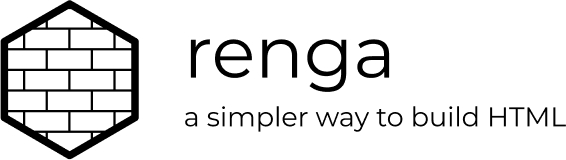

<p align='center'></p>

# renga

A simply utility for laying down HTML with Javascript.

Let's say you wanted to build this HTML with Javascript:

```html
<button id="submit-btn" class="btn btn-primary">Primary</button>
```

Normally you would need to do something like:

```javascript
let button = document.createElement('button')
button.classList.add('btn', 'btn-primary')
button.setAttribute('id', 'submit-btn')
button.innerText = 'Primary'
```

With renga it's as simple as:

```javascript
button({id: 'submit-btn', class: 'btn btn-primary'}, 'Primary')
```

## Installation

Install with npm:

```
npm install renga
```

or with yarn:

```
yarn add renga
```

## Building HTML

To start using renga to build elements use the following import at the
top of your file:

```javascript
import { element } from 'renga'

const { button, span, table, fragment, text } = element
// ...
```

> As you find yourself needing additional elements you can extend the
destructing.

When creating elements with renga that have no attributes you can simply
set the first parameter to a valid child.

**Strings become TextNode children:**
```javascript
button('Primary')
// -> <button>Primary</button>
```

**A child can be another HTML node:**
```javascript
header(h1('Title'))
// -> <header><h1>Title</h1></header>
```

**Use an array to set siblings as children of a given element:**
```javascript
span(['You have ', strong('14 days'), ' remaining on your trial.'])
// -> <span>You have <strong>14 days</strong> remaining on your trial.</span>
```

**You can arbitrarily nest the HTML structure:**
```javascript
table([
  thead(
    tr(
      th('Column Header')
    )
  ),
  tbody(
    tr(
      td('Cell Content')
    )
  )
])

/*
<table>
  <thead>
    <tr>
      <th>Column Header</th>
    </tr>
  </thead>
  <tbody>
    <tr>
      <td>Cell Content</td>
    </tr>
  </tbody>
</table>
*/
```

**If you need a stand-alone `TextNode` you can use `text()`:**
```javascript
const paymentText = text('Your payment is due tomorrow.')

span(paymentText)
// -> <span>Your payment is due tomorrow.</span>
```

**You can create a `DOM Fragment` using `fragment()`:**
```javascript
const collection = fragment([span('First'), strong('Second'), 'Third'])

section(collection)
// -> <section><span>First</span><strong>Second</strong>Third</section>
```

## Setting Attributes

When you need to add attributes to an element the first argument should
be an object containing the attributes you would like to add.

The second argument would then be the children for the given node.

```javascript
button({class: 'btn btn-primary'}, 'Primary Button')
// -> <button class='btn btn-primary'>Primary Button</button>
```

Keep in mind that renga will handle converting camelCase attribute
names to kabob-case accordingly.

```javascript
button({dataId: '123', dataModel: 'user', class: 'btn btn-danger'}, 'Delete User')
// -> <button data-id='123' data-model='user'>Delete User</button>
```


## Setting Events

You can set DOM events directly on a given node by adding them to the
`events` key in the attributes object provided to the node creator:

```javascript
const alertButton = button({
  class: 'btn btn-default',
  events: {
    click() { alert('Button was clicked!') }
  }
}, 'Show Alert')
// -> <button class='btn btn-default'>Show Alert</button>
```

## Setting Styles

There are two ways to set inline styles on a node.

You can set the `style` attribute to a string of css declarations:

```javascript
section({style: 'display: flex; flex-flow: row nowrap; align-items: center; justify-content: space-between;'})
```

Or you can set `style` to an object containing css declarations:

```javascript
section({
  style: {
    display: 'flex',
    flexFlow: 'row nowrap',
    alignItems: 'center',
    justifyContent: 'space-between'
  }
})
```

## Scoping Styles

An added feature supported by renga is the ability to scope css so that
you can avoid precedence issues and keep a flat hierarchy in your
stylesheets.

This feature was influenced by [CSS Modules](https://github.com/css-modules/css-modules)
and the way that they allow you to scope styles to a component or module.

First we set up our scoped styles:

```javascript
import { element, scopeStyles } from 'renga'

const { section, button, style } = element

const { classNames, styles } = scopeStyles('ButtonGroup', `
  .container {
    display: flex;
    flex-flow: row nowrap;
    align-items: center;
    justifyContent: space-between;
  }

  .pullLeft {
    margin-right: auto;
  }

  .pullRight {
    margin-left: auto;
  }
`)
```

We can then wrap `styles` in a `style` tag and append it as necessary:

```javascript
style(styles)

/*
<style>
  .ButtonGroup__container {
    display: flex;
    flex-flow: row nowrap;
    align-items: center;
    justifyContent: space-between;
  }

  .ButtonGroup__pullLeft {
    margin-right: auto;
  }

  .ButtonGroup_pullRight {
    margin-left: auto;
  }
</style>
*/
```

To set the translated class names we can use the destructured
`classNames` variable:

```javascript
section({class: classNames.container}, [
  button({class: classNames.pullLeft}, 'Delete'),
  button({class: classNames.pullRight}, 'Cancel'),
  button({class: classNames.pullRight}, 'Save')
])

/*
<section class="ButtonGroup__container">
  <button class="ButtonGroup__pullLeft">Delete</button>
  <button class="ButtonGroup__pullRight">Cancel</button>
  <button class="ButtonGroup__pullRight">Save</button>
</section>
*/
```

> Note: `scopeStyles()` takes an optional third argument which is a
string to but used as a postfix hash on the translated names (turning
`ButtonGroup__container` into `ButtonGroup__container__<hash>`).

## More Examples

Will have examples pulled from bootstrap and translated here.
