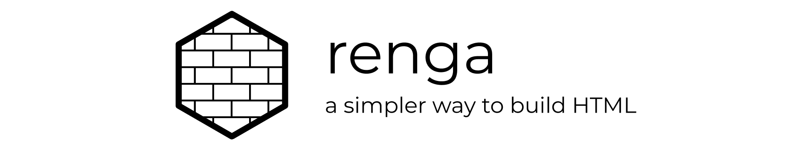

**THIS PROJECT IS NOT READY YET! PLEASE COME BACK LATER 😉**

<p align='center'></p>

# renga

A simply utility for laying down HTML with Javascript.

Let's say you wanted to build this HTML with Javascript:

```html
<button id="submit-btn" class="btn btn-primary">Apply Now</button>
```

Normally you would need to do something like:

```javascript
let button = document.createElement('button')
button.classList.add('btn', 'btn-primary')
button.setAttribute('id', 'submit-btn')
button.innerText = 'Apply Now'
```

With renga it's as simple as:

```javascript
button({id: 'submit-btn', class: 'btn btn-primary'}, 'Apply Now')
```

## Installation

Install with npm:

```
npm install renga
```

or with yarn:

```
yarn add renga
```

## Building HTML

To start building HTML elements with renga use the following import:

```javascript
import { element } from 'renga'
```

At the top of the file you can then use object destructing to pull out
element constructors as necessary:

```javascript
const { button, span, table, fragment, text } = element
```

When creating elements with renga that have no attributes you can
simply set the first parameter to a valid child.

**Strings become TextNode children:**
```javascript
button('Create')
// -> <button>Create</button>
```

**A child can be another HTML node:**
```javascript
header(h1('Overview'))
// -> <header><h1>Overview</h1></header>
```

**Use an array to set a collection of nodes as children of a given
element:**
```javascript
span(['You have ', strong('14 days'), ' remaining on your free trial.'])
// -> <span>You have <strong>14 days</strong> remaining on your free trial.</span>
```

**You can arbitrarily nest the HTML structure:**
```javascript
table([
  caption('Programming Languages'),
  thead(
    tr(
      th('Name'),
      th('Creator'),
      th('Year Released')
    )
  ),
  tbody(
    tr(
      td('Javascript'),
      td('Brendan Eich'),
      td('1995')
    ),
    tr(
      td('Python'),
      td('Guido van Rossum'),
      td('1991')
    ),
    tr(
      td('Ruby'),
      td('Yukihiro Matsumoto'),
      td('1995')
    )
  )
])

/*
<table>
  <caption>Programming Languages</caption>
  <thead>
    <tr>
      <th>Name</th>
      <th>Creator</th>
      <th>Year Released</th>
    </tr>
  </thead>
  <tbody>
    <tr>
      <td>Javascript</td>
      <td>Brendan Eich</td>
      <td>1995</td>
    </tr>
    <tr>
      <td>Python</td>
      <td>Guido van Rossum</td>
      <td>1991</td>
    </tr>
    <tr>
      <td>Ruby</td>
      <td>Yukihiro Matsumoto</td>
      <td>1995</td>
    </tr>
  </tbody>
</table>
*/
```

**If you need a stand-alone `TextNode` you can use `text()`:**
```javascript
const paymentText = text('Your payment is due tomorrow.')

span(paymentText)
// -> <span>Your payment is due tomorrow.</span>
```

**You can create a `DOM Fragment` using `fragment()`:**
```javascript
const collection = fragment([h2('Well Done!'), p('You have completed all of your tasks.')])

section(collection)
// -> <section><h2>Well Done!</h2><p>You have completed all of your tasks.</p></section>
```

## Setting Attributes

When you need to add attributes to an element the first argument should
be an object containing the attributes you would like to add.

The second argument should be the child or children of the element
being created.

```javascript
button({class: 'btn btn-danger'}, 'Delete User')
// -> <button class='btn btn-danger'>Delete User</button>
```

Keep in mind that renga will handle converting camelCase attribute
names to kabob-case accordingly.

```javascript
button({dataId: '123', dataModel: 'user', class: 'btn btn-danger'}, 'Delete User')
// -> <button data-id='123' data-model='user'>Delete User</button>
```


## Attaching Events

You can attach DOM events directly to a given node by adding them under
the `events` key in the attributes object provided to the node
constructor:

```javascript
button({
  class: 'btn btn-warning',
  events: {
    click() { alert('Are you sure?') }
  }
}, 'Remove')
// -> <button class='btn btn-warning'>Remove</button>
```

## Styling Elements

There are two ways to set inline styles on a node.

1. You can set the `style` attribute to a string containing CSS
declarations:

```javascript
section({style: 'display: flex; flex-flow: row nowrap; align-items: center; justify-content: space-between;'})
```

2. You can set the `style` attribute to an object containing CSS
declarations:

```javascript
section({
  style: {
    display: 'flex',
    flexFlow: 'row nowrap',
    alignItems: 'center',
    justifyContent: 'space-between'
  }
})
```

## Scoping Styles

An added feature supported by renga is the ability to scope CSS based
on the name of a module or component.

This can provide a flat hierarchy in your stylesheets, making it easier
to avoid name collisions in your class names.

> This feature was influenced by [CSS Modules](https://github.com/css-modules/css-modules).

First we set up our scoped styles, providing a name to scope by
(`ButtonGroup`):

```javascript
import { element, scopeStyles } from 'renga'

const { section, button, style } = element

const { classNames, styles } = scopeStyles('ButtonGroup', `
  .container {
    display: flex;
    flex-flow: row nowrap;
    align-items: center;
    justifyContent: space-between;
  }

  .pullLeft {
    margin-right: auto;
  }

  .pullRight {
    margin-left: auto;
  }
`)
```

We can then wrap `styles` in a `style` tag and append it as necessary.
Notice how the class names have been prefixed with the module name we
provided:

```javascript
style(styles)

/*
<style>
  .ButtonGroup__container {
    display: flex;
    flex-flow: row nowrap;
    align-items: center;
    justifyContent: space-between;
  }

  .ButtonGroup__pullLeft {
    margin-right: auto;
  }

  .ButtonGroup_pullRight {
    margin-left: auto;
  }
</style>
*/
```

To set the translated class names we can use the destructured
`classNames` variable. It is an object with keys corresponding to the
class names specified in your styles and values which correlate
to the translated names:

```javascript
section({class: classNames.container}, [
  button({class: classNames.pullLeft}, 'Delete'),
  button({class: classNames.pullRight}, 'Cancel'),
  button({class: classNames.pullRight}, 'Save')
])

/*
<section class="ButtonGroup__container">
  <button class="ButtonGroup__pullLeft">Delete</button>
  <button class="ButtonGroup__pullRight">Cancel</button>
  <button class="ButtonGroup__pullRight">Save</button>
</section>
*/
```

In the case that you would like to add a suffix to the translated
class names `scopeStyles()` takes an optional third argument which is a
string to but used as a postfix hash on the translated names:

`ButtonGroup__container` into `ButtonGroup__container__<hash>`

## More Examples

Will have examples pulled from bootstrap and translated here.
